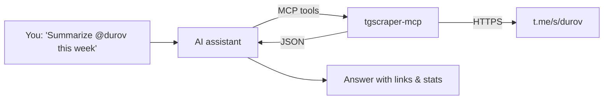

<div align="center">

# 📡 Telegram Scraper

**Scrape, search, monitor and analyze any public Telegram channel — no API key, no login, no phone number.**

Python library · CLI · MCP server for AI agents · Claude Skill · Web dashboard · Docker

[](https://github.com/specialteam/TelegramScraper/actions)


[Quick start](#-quick-start) · [CLI](#-command-line) · [Python](#-python-library) · [AI / MCP](#-use-it-from-ai-assistants-mcp--skill) · [Dashboard](#-web-dashboard) · [فارسی](#-راهنمای-فارسی)

</div>

```bash
pip install "tgscraper[all] @ git+https://github.com/specialteam/TelegramScraper"
tgscraper durov
```

That's it — the latest posts of `t.me/durov`, in your terminal.

---

## ✨ Features

| | |
|---|---|
| 🔓 **Zero setup** | Uses the public web preview `t.me/s/<channel>`. No `api_id`, no session files, no account ban risk. |
| 🧾 **Rich data** | id, date, text, HTML, views, reactions, author, edited, forwards, replies, photos, videos, voice, documents, link previews, hashtags, mentions, links. |
| 🔎 **Search & filters** | Telegram's server-side search, date ranges, keywords, regex, hashtags, media type, minimum views. |
| 💾 **Export anywhere** | JSON, JSON Lines, CSV (Excel-friendly UTF-8), Excel `.xlsx`, SQLite (upsert archive), Markdown. |
| ⚡ **Fast & robust** | Async + concurrent multi-channel scraping, retries with backoff, `Retry-After` handling, rate limiting, rotating HTTP/SOCKS proxies. |
| 🔁 **Incremental** | Remembers the last post per channel — the next run fetches only new posts. |
| 👀 **Monitor** | Watch channels and push new posts to a webhook (Slack, Discord, n8n…) or a Telegram bot. |
| 🖼 **Media download** | Save photos, videos and voice notes of any post. |
| 📊 **Analytics** | Top posts, posting frequency by day/hour/weekday, hashtags, top words, reactions, EN/FA sentiment. |
| 🤖 **AI-native** | MCP server with 8 tools, a ready-made Claude Skill, and `--json` output for every command. |
| 🖥 **Dashboard** | Streamlit UI with charts and one-click export. |
| 🐳 **Docker** | Run the CLI, the dashboard or a 24/7 monitor in a container. |

---

## 🚀 Quick start

### Install

```bash
# everything (CLI + Excel + MCP server + dashboard)
pip install "tgscraper[all] @ git+https://github.com/specialteam/TelegramScraper"

# or minimal (CLI + library only: httpx + beautifulsoup4)
pip install "git+https://github.com/specialteam/TelegramScraper"

# or from a clone
git clone https://github.com/specialteam/TelegramScraper && cd TelegramScraper && pip install -e ".[all]"
```

### Three ways to use it

```bash
tgscraper durov -n 100 -o durov.csv       # 1. command line
```

```python
import tgscraper as tg                      # 2. Python
posts = tg.scrape("durov", limit=100)
```

```text
"What did @durov post this week?"           # 3. ask your AI assistant (MCP / Skill)
```

---

## 💻 Command line

Anything that looks like a channel works: `durov`, `@durov`, `t.me/durov`, `https://t.me/s/durov`.

```bash
tgscraper durov                                  # latest 20 posts, pretty output
tgscraper durov -n 500 -o durov.xlsx             # save (.json .jsonl .csv .xlsx .db .md)
tgscraper durov -n 0 -o full_history.db          # the whole channel history (-n 0 = no limit)
tgscraper durov telegram tginfo -n 50 -o all.db  # several channels into one SQLite file

tgscraper durov --since 2026-01-01 --until 2026-01-31
tgscraper durov -n 300 -k ton -k bitcoin         # keyword filter (any of them)
tgscraper durov --regex "v\d+\.\d+"              # regex filter
tgscraper durov --hashtag news --min-views 50000
tgscraper durov --media-only --media-type video

tgscraper search durov "privacy" -n 30           # Telegram's own full-history search
tgscraper info durov                             # title, description, subscribers, counters
tgscraper stats durov -n 300                     # analytics report (or: tgscraper stats durov.json)
tgscraper media durov -n 50 -d ./media           # download photos & videos
tgscraper durov --incremental -o archive.db      # only posts newer than the last run

tgscraper watch durov telegram -i 120                                  # print new posts live
tgscraper watch durov --webhook https://hooks.slack.com/services/...  # push to a webhook
tgscraper watch durov -k airdrop --bot-token 123:ABC --chat-id 42     # alert via your Telegram bot

tgscraper durov --json | jq '.[] | {url, views}' # machine-readable output for scripts & agents
tgscraper durov -p socks5://127.0.0.1:1080       # proxy (repeat -p to rotate several)
```

<details>
<summary><b>Example: <code>tgscraper stats</code> (illustrative output)</b></summary>

```text
📊 300 messages from durov
   2025-03-02T10:14:00+00:00  →  2026-09-20T16:40:00+00:00  (1.3 posts/day)
👁  total views 412,905,120 · average 1,376,350
📎 with media 121 {'photo': 88, 'video': 33} · forwarded 4
🙂 sentiment avg +0.21 (+97 / =180 / -23)

🔥 Top posts:
   4,812,000  https://t.me/durov/301  'Telegram now has ...'
...
🕒 Posts by hour (UTC):
   14 ██████████████ 41
   15 ██████████████████████████████ 87
```
</details>

Run `tgscraper --help` or `tgscraper <command> --help` for every option.

---

## 🐍 Python library

```python
import tgscraper as tg

# Channel info
info = tg.channel_info("durov")
print(info.title, info.subscribers, info.description)

# Latest posts — list of Message objects, newest first
posts = tg.scrape("durov", limit=100)
for p in posts:
    print(p.date, p.views, p.url, p.text[:80], p.media_types, p.reactions)

# Filters (all optional, combine freely)
posts = tg.scrape(
    "durov", limit=None,              # None = whole history
    since="2026-01-01", until="2026-06-30",
    keywords=["ton", "wallet"], regex=r"\bv\d+", hashtag="update",
    media_only=True, media_types=["photo"], min_views=100_000,
)

tg.search("durov", "privacy", limit=20)          # Telegram server-side search
tg.get_message("durov", 123)                     # one post
tg.scrape("durov", incremental=True)             # only new posts since last incremental call

# Many channels concurrently
results = tg.scrape_many(["durov", "telegram", "tginfo"], limit=200)   # {channel: [Message] | Exception}

# Export / load
tg.export(posts, "posts.xlsx")                   # .json .jsonl .csv .xlsx .db .md
posts = tg.load("posts.json")                    # from .json .jsonl .db

# Analytics
stats = tg.summarize(posts)                      # JSON-friendly dict
print(tg.format_summary(stats))
tg.sentiment("Great news, bullish!")             # -1 .. 1 (EN + FA lexicon)

# Media
tg.download_media(posts, "media/", types=["photo", "video"])

# Monitor forever
tg.watch(["durov"], [tg.webhook_notifier("https://example.com/hook"), print], interval=60)
```

<details>
<summary><b>Advanced: reusable / async clients, proxies, streaming</b></summary>

```python
from tgscraper import Scraper, AsyncScraper, MessageFilter

with Scraper(proxies=["socks5://p1:1080", "http://p2:8080"], timeout=20, retries=3, delay=0.5) as s:
    for msg in s.iter_messages("durov", limit=None, filter=MessageFilter(since="2026-01-01")):
        print(msg.id)                     # streams page by page, low memory

async with AsyncScraper(concurrency=10) as s:
    posts = await s.get_messages("durov", 1000)
    async for msg in s.iter_messages("telegram", 50, query="stories"):
        ...
```
</details>

### Message fields

```json
{
  "id": 123, "channel": "durov", "url": "https://t.me/durov/123",
  "date": "2026-01-10T09:30:00+00:00", "text": "…", "html": "…",
  "views": 1250000, "author": null, "edited": false,
  "forwarded_from": null, "reply_to": 120,
  "media": [{"type": "photo", "url": "https://cdn4.telesco.pe/…jpg", "thumbnail": "…", "duration": null, "title": null}],
  "reactions": {"👍": 15000, "🔥": 3200},
  "hashtags": ["news"], "mentions": ["telegram"], "links": ["https://telegram.org/blog"]
}
```

Media types: `photo`, `video`, `round_video`, `voice`, `audio`, `document`, `sticker`, `link_preview`.

---

## 🤖 Use it from AI assistants (MCP + Skill)

Telegram Scraper ships an **[MCP](https://modelcontextprotocol.io) server**, so Claude, Cursor, VS Code Copilot,
Windsurf, ChatGPT and any MCP client can read Telegram channels for you.



### MCP tools

| Tool | What it does |
|---|---|
| `get_channel_info` | Title, description, subscribers, photo, media counters |
| `get_messages` | Latest posts with filters (dates, keywords, hashtag, media, views, paging with `before_id`) |
| `search_messages` | Full-history search inside a channel |
| `get_message` | One post by id (for `t.me/<channel>/<id>` links) |
| `get_new_messages` | Only posts newer than an id — follow a channel over time |
| `analyze_channel` | Stats: top posts, activity, hours, hashtags, words, reactions, sentiment |
| `compare_channels` | Side-by-side: subscribers, posts/day, avg views, engagement rate |
| `export_messages` | Save posts to a local `.json/.csv/.xlsx/.db/.md` file |

Plus prompts `summarize_channel` and `track_topic`, and the resource `telegram://channel/{channel}`.

### Connect it

The only requirement is [uv](https://docs.astral.sh/uv/) (`pip install uv`) — `uvx` downloads and runs the server
on demand. Or `pip install "tgscraper[mcp] @ git+…"` and use `"command": "tgscraper-mcp"` with no args.

<details open>
<summary><b>Claude Code</b></summary>

```bash
claude mcp add telegram-scraper -- uvx --from "tgscraper[mcp] @ git+https://github.com/specialteam/TelegramScraper" tgscraper-mcp
```
Inside this repository it is automatic: [`.mcp.json`](.mcp.json) registers the server and
[`.claude/skills/telegram-scraper`](.claude/skills/telegram-scraper/SKILL.md) loads the skill.
</details>

<details>
<summary><b>Claude Desktop</b> · <b>Cursor</b> · <b>Windsurf</b> · any JSON-configured client</summary>

Add to `claude_desktop_config.json` (Settings → Developer → Edit config), `~/.cursor/mcp.json`,
or `~/.codeium/windsurf/mcp_config.json`:

```json
{
  "mcpServers": {
    "telegram-scraper": {
      "command": "uvx",
      "args": ["--from", "tgscraper[mcp] @ git+https://github.com/specialteam/TelegramScraper", "tgscraper-mcp"],
      "env": { "TGSCRAPER_PROXY": "" }
    }
  }
}
```
</details>

<details>
<summary><b>VS Code (Copilot agent mode)</b></summary>

`.vscode/mcp.json`:
```json
{
  "servers": {
    "telegram-scraper": {
      "type": "stdio",
      "command": "uvx",
      "args": ["--from", "tgscraper[mcp] @ git+https://github.com/specialteam/TelegramScraper", "tgscraper-mcp"]
    }
  }
}
```
</details>

<details>
<summary><b>Remote / HTTP (ChatGPT connectors, n8n, other hosts)</b></summary>

```bash
tgscraper mcp --transport streamable-http     # serves MCP over HTTP
```
</details>

Environment variables: `TGSCRAPER_PROXY` (proxy URL for all requests), `TGSCRAPER_MCP_MAX_LIMIT` (default 500).

### Claude Skill

[`.claude/skills/telegram-scraper/SKILL.md`](.claude/skills/telegram-scraper/SKILL.md) teaches an agent when and how
to use the CLI (commands, JSON schema, how to cite results). Install it for all your projects:

```bash
mkdir -p ~/.claude/skills && cp -r .claude/skills/telegram-scraper ~/.claude/skills/
```

For claude.ai, zip the `telegram-scraper` folder and upload it under **Settings → Capabilities → Skills**.

**Try asking:**
- *"What are the 5 most viewed posts on @durov this year?"*
- *"Compare the engagement of these three crypto channels: …"*
- *"Search @xyz for 'airdrop' and give me the dates and links."*
- *"Export the last 1000 posts of t.me/abc to Excel."*

Other agents: [`AGENTS.md`](AGENTS.md) and [`llms.txt`](llms.txt) describe the project for LLMs.

---

## 🖥 Web dashboard

```bash
pip install "tgscraper[dashboard] @ git+https://github.com/specialteam/TelegramScraper"
tgscraper dashboard            # → http://localhost:8501
```

Channel metrics, posts table with links, activity/views charts, top words & hashtags, CSV/JSON/Markdown download.

## 🐳 Docker

```bash
docker build -t tgscraper .
docker run --rm -v "$PWD/data:/data" tgscraper durov -n 100 -o durov.csv
docker compose up dashboard                    # dashboard on :8501
docker compose --profile watch up -d watch     # 24/7 monitor archiving to data/archive.db
```

---

## ❓ FAQ

**Does it need a Telegram account or API key?** No. It reads the same public page you see at `https://t.me/s/durov`.

**Which channels work?** Public channels with web preview enabled. Private channels, groups, DMs and bots don't have a
public preview — use [Telethon](https://github.com/LonamiWebs/Telethon) for those.

**`ChannelNotFound`?** The name is wrong, the channel is private, or its owner disabled the web preview.

**Getting HTTP 429 / blocked?** The scraper already retries with backoff. Increase `delay`, lower concurrency, or
rotate proxies (`-p` multiple times). In regions where Telegram is filtered, use `-p socks5://…`.

**Can I get comments / member lists?** No — they are not part of the public preview.

**How accurate is sentiment?** It's a small English/Persian word list: good for trends, not for single posts.

## 🧑‍💻 Development

```bash
pip install -e ".[dev]"
pytest -q            # offline tests with HTML fixtures, no network needed
```

Project layout:

```
tgscraper/
  client.py      Scraper / AsyncScraper: paging, retries, proxies
  parser.py      t.me/s HTML → Message / Channel
  models.py      Message, Media, Channel dataclasses
  filters.py     MessageFilter
  exporters.py   json, jsonl, csv, xlsx, sqlite, md
  analytics.py   summarize(), sentiment()
  monitor.py     watch() + webhook / Telegram bot notifiers
  media.py       download_media()
  state.py       incremental state
  cli.py         `tgscraper` command
  mcp_server.py  `tgscraper-mcp` MCP server
  dashboard.py   Streamlit app
```

The old `from telegram_scraper import TelegramScraper` API still works.

## ⚖️ Responsible use

Only public data is accessed. Respect Telegram's Terms of Service, local laws and people's privacy; keep request
rates reasonable. This project is not affiliated with Telegram.

---

## 🇮🇷 راهنمای فارسی

<div dir="rtl">

**Telegram Scraper** ابزاری برای خواندن، جست‌وجو، مانیتور و تحلیل **کانال‌های عمومی تلگرام** است؛ بدون API،
بدون لاگین و بدون شماره تلفن.

### نصب

</div>

```bash
pip install "tgscraper[all] @ git+https://github.com/specialteam/TelegramScraper"
```

<div dir="rtl">

### مهم‌ترین دستورها

</div>

```bash
tgscraper durov                          # ۲۰ پست آخر
tgscraper durov -n 500 -o durov.xlsx     # ذخیره در اکسل (یا csv / json / db / md)
tgscraper durov --since 2026-01-01 -k بیت‌کوین
tgscraper search durov "privacy"         # جست‌وجو در کل تاریخچه
tgscraper info durov                     # اطلاعات و تعداد اعضای کانال
tgscraper stats durov -n 300             # آمار: پربازدیدها، ساعت‌های فعالیت، هشتگ‌ها، احساسات
tgscraper media durov -d ./media         # دانلود عکس و ویدیو
tgscraper watch durov --bot-token TOKEN --chat-id ID   # اعلان پست جدید با ربات تلگرام
tgscraper durov -p socks5://127.0.0.1:1080             # استفاده از پراکسی
tgscraper dashboard                      # داشبورد وب
```

<div dir="rtl">

### پایتون

</div>

```python
import tgscraper as tg
posts = tg.scrape("durov", limit=100, since="2026-01-01")
tg.export(posts, "posts.csv")
print(tg.format_summary(tg.summarize(posts)))
```

<div dir="rtl">

### اتصال به هوش مصنوعی

- **MCP:** با تنظیمات بخش [AI / MCP](#-use-it-from-ai-assistants-mcp--skill) به Claude، Cursor، VS Code و … وصل
  کنید. بعد کافی است بپرسید: «پربازدیدترین پست‌های این هفته‌ی @durov چی بوده؟»
- **Skill:** پوشه‌ی `.claude/skills/telegram-scraper` را در `~/.claude/skills/` کپی کنید.
- خروجی همه‌ی دستورها با `--json` برای ایجنت‌ها و اسکریپت‌ها قابل خواندن است.

فقط کانال‌هایی که پیش‌نمایش وب (`t.me/s/...`) دارند پشتیبانی می‌شوند. در ایران برای دسترسی از پراکسی استفاده کنید.

</div>

---

<div align="center">

MIT License · If this project helps you, give it a ⭐

<sub>Keywords: telegram scraper, telegram channel scraper, scrape telegram without api, t.me scraper, telegram
crawler, telegram osint, telegram to csv, telegram to excel, telegram monitor, telegram mcp server, mcp telegram,
claude telegram, ai agent telegram tool, python telegram scraper, اسکرپر تلگرام, استخراج پیام کانال تلگرام</sub>

</div>
